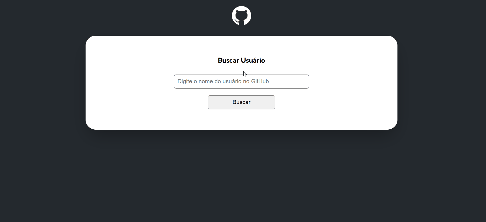

## Projeto API Github com Javascript

Neste projeto é utilizado javascript para consumir a API do Github e trazer de forma organizade as informações de qualquer usuário cadastrado. É exibido na tela informações como a foto, eventos e repositórios onde é possível acessar o repositório através da aplicação. 👤



## Tecnologias Utilizadas

- HTML5
- CSS3
- JAVASCRIPT

## Dificuldades Encontradas

A maior dificuldade foi sem dúvida fazer a chamada da api e fazer o tratamento de erro caso o usuário digite alguma informação errada ou caso a api não encontre um usuário que foi digitado. Com certeza através desse projeto eu consegui desenvolver minha habilidade na chamada de api utilizando método fetch onde eu poderei utilizar esse conhecimento em outros projetos e também na minha carreira.

```javascript

async function getUserData(userName){

    const userResponse = await getUser(userName) // Buscando os dados na api do GitHub

    if(userResponse.message === 'Not Found'){
        screen.renderUserNotFound()
        return
    }
    user.setInfo(userResponse) // Atribuindo o objeto que criamos com a resposta da api

    const repositoriesResponse = await getRepositories(userName)
    user.setRepositories(repositoriesResponse)

    const eventsResponse = await getEvents(userName)
    user.setEvents(eventsResponse)
    
    
    screen.renderUser(user) // Enviando o user para o objeto screen, para ele ser mostrado ao usuário
}
```

## Autor

- Linkedin - [Breno Henrique](https://www.linkedin.com/in/breno-henrique-matos-17054219b/)
- GitHub - [Breno Matos](https://github.com/Breno-Matos)